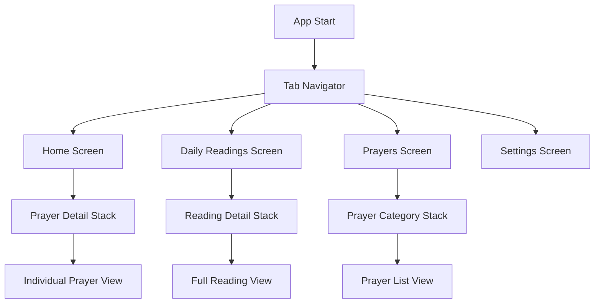

# Prayer App - ICCEC Europe
## Technical Architecture & Specification Document

### Project Overview

**Project Name:** Prayer App - ICCEC Europe  
**Platform:** Expo React Native (iOS & Android)  
**Language:** TypeScript  
**Target Users:** Mixed age groups within ICCEC Europe community  
**Architecture Pattern:** Offline-first with optional online sync capability  

### Requirements Summary

#### Core Features
- **Multi-language Support:** English (en), Tagalog (tl), Estonian (et)
- **Four Main Screens:** Home, Daily Readings, Prayers, Settings
- **Content Types:** Mixed liturgical and contemporary prayers, flexible daily readings
- **Data Storage:** Local JSON files with future API integration capability
- **Settings Persistence:** Language preferences, font size, user customizations
- **Accessibility:** Standard accessibility features for mixed age demographics
- **Offline-First:** Full functionality without internet connection

#### Technical Requirements
- Expo SDK 53.0.20 compatibility with Expo Go
- TypeScript for type safety
- Modern, accessible UI design
- Scalable architecture for future enhancements
- Clean separation of concerns
- Easy content management and updates

---

## 1. Dependencies & Package Management

### Core Dependencies

```json
{
  "dependencies": {
    "expo": "~53.0.20",
    "react": "18.3.1",
    "react-native": "0.75.3",
    "typescript": "^5.3.3"
  }
}
```

### Navigation Dependencies
```json
{
  "@react-navigation/native": "^6.1.18",
  "@react-navigation/bottom-tabs": "^6.6.1",
  "@react-navigation/stack": "^6.4.1",
  "react-native-screens": "~3.34.0",
  "react-native-safe-area-context": "4.11.0"
}
```

**Justification:** React Navigation v6 provides mature, performant navigation with excellent TypeScript support and accessibility features. Updated versions ensure compatibility with React Native 0.75.x.

### Internationalization Dependencies
```json
{
  "expo-localization": "~15.0.3",
  "i18n-js": "^4.4.3"
}
```

**Justification:** Expo-localization provides device locale detection, i18n-js offers lightweight, flexible translation management. Updated for SDK 53 compatibility.

### Storage Dependencies
```json
{
  "@react-native-async-storage/async-storage": "1.24.0"
}
```

**Justification:** Standard for React Native persistent storage, well-maintained and reliable. Updated version ensures compatibility with React Native 0.75.x.

### UI & Styling Dependencies
```json
{
  "react-native-vector-icons": "^10.2.0",
  "@expo/vector-icons": "^14.0.4",
  "react-native-paper": "^5.12.5"
}
```

**Justification:** React Native Paper provides Material Design components with excellent accessibility support and theming capabilities. All packages verified for Expo Go compatibility.

### Development Dependencies
```json
{
  "@types/react": "~18.3.12",
  "@types/react-native": "~0.75.15",
  "@typescript-eslint/eslint-plugin": "^8.0.0",
  "@typescript-eslint/parser": "^8.0.0",
  "eslint": "^8.57.0",
  "prettier": "^3.3.0"
}
```

### Expo SDK 53 Compatibility Notes

**Important:** All dependencies have been updated to ensure full compatibility with Expo SDK 53.0.20 and Expo Go. Key compatibility considerations:

- **React Native 0.75.x:** Major version update with improved performance and new architecture support
- **React 18.3.x:** Latest stable React version with concurrent features
- **TypeScript 5.3.x:** Enhanced type checking and modern JavaScript features
- **Navigation:** Updated React Navigation packages ensure smooth navigation with new React Native version
- **Expo Go Compatibility:** All specified packages work with the standard Expo Go app without requiring development builds

**Breaking Changes from SDK 50 to SDK 53:**
- Updated minimum iOS version requirement (iOS 13.4+)
- Enhanced new architecture (Fabric/TurboModules) support
- Improved Metro bundler configuration
- Updated Hermes JavaScript engine with better performance

---

## 2. Project Structure

```
src/
├── components/           # Reusable UI components
│   ├── common/          # Generic components
│   │   ├── TileCard.tsx
│   │   ├── Header.tsx
│   │   ├── PrimaryButton.tsx
│   │   └── index.ts
│   ├── prayers/         # Prayer-specific components
│   │   ├── PrayerCard.tsx
│   │   ├── PrayerList.tsx
│   │   └── index.ts
│   └── readings/        # Reading-specific components
│       ├── ReadingCard.tsx
│       ├── ReadingText.tsx
│       └── index.ts
├── screens/             # Screen components
│   ├── HomeScreen.tsx
│   ├── DailyReadingsScreen.tsx
│   ├── PrayersScreen.tsx
│   └── SettingsScreen.tsx
├── navigation/          # Navigation configuration
│   ├── AppNavigator.tsx
│   ├── TabNavigator.tsx
│   └── types.ts
├── services/            # Business logic & data services
│   ├── DataService.ts
│   ├── StorageService.ts
│   ├── LocalizationService.ts
│   └── index.ts
├── data/               # Local JSON data files
│   ├── prayers/
│   │   ├── en.json
│   │   ├── tl.json
│   │   └── et.json
│   ├── readings/
│   │   ├── en.json
│   │   ├── tl.json
│   │   └── et.json
│   └── translations/
│       ├── en.json
│       ├── tl.json
│       └── et.json
├── hooks/              # Custom React hooks
│   ├── useSettings.ts
│   ├── useLocalization.ts
│   └── useData.ts
├── types/              # TypeScript type definitions
│   ├── Prayer.ts
│   ├── Reading.ts
│   ├── Settings.ts
│   └── index.ts
├── styles/             # Styling and theming
│   ├── theme.ts
│   ├── colors.ts
│   ├── typography.ts
│   └── spacing.ts
└── utils/              # Utility functions
    ├── dateUtils.ts
    ├── textUtils.ts
    └── index.ts
```

### Folder Purpose Definitions

- **`components/`**: Reusable UI components organized by domain
- **`screens/`**: Top-level screen components for navigation
- **`navigation/`**: Navigation configuration and type definitions
- **`services/`**: Business logic, data access, and external service integrations
- **`data/`**: Local JSON files organized by content type and language
- **`hooks/`**: Custom React hooks for shared stateful logic
- **`types/`**: TypeScript interfaces and type definitions
- **`styles/`**: Design system tokens and theming configuration
- **`utils/`**: Pure utility functions and helpers

---

## 3. Navigation Architecture

### Navigation Flow Diagram



### Navigation Structure

```typescript
// navigation/types.ts
export type RootTabParamList = {
  Home: undefined;
  DailyReadings: undefined;
  Prayers: undefined;
  Settings: undefined;
};

export type HomeStackParamList = {
  HomeMain: undefined;
  PrayerDetail: { prayerId: string };
};

export type PrayersStackParamList = {
  PrayersList: undefined;
  PrayerDetail: { prayerId: string };
  PrayerCategory: { categoryId: string };
};

export type ReadingsStackParamList = {
  ReadingsList: undefined;
  ReadingDetail: { readingId: string; date?: string };
};
```

### Navigation Implementation Strategy

1. **Bottom Tab Navigator** as the root navigator
2. **Stack Navigators** nested within each tab for detailed views
3. **Type-safe navigation** using TypeScript parameter lists
4. **Accessibility labels** for all navigation elements
5. **Deep linking support** for future web integration

---

## 4. Data Architecture

### Prayer Data Schema

```typescript
// types/Prayer.ts
export interface Prayer {
  id: string;
  title: string;
  category: PrayerCategory;
  content: string;
  source?: string;
  tags: string[];
  language: SupportedLanguage;
  metadata: {
    createdAt: string;
    updatedAt: string;
    version: number;
  };
}

export enum PrayerCategory {
  LITURGICAL = 'liturgical',
  CONTEMPORARY = 'contemporary',
  PERSONAL = 'personal',
  INTERCESSION = 'intercession',
  THANKSGIVING = 'thanksgiving',
  CONFESSION = 'confession'
}

export type SupportedLanguage = 'en' | 'tl' | 'et';
```

### Daily Reading Data Schema

```typescript
// types/Reading.ts
export interface DailyReading {
  id: string;
  date: string; // ISO date string
  title: string;
  readings: Reading[];
  reflection?: string;
  language: SupportedLanguage;
  metadata: {
    liturgicalSeason?: string;
    feast?: string;
    createdAt: string;
    updatedAt: string;
  };
}

export interface Reading {
  id: string;
  type: ReadingType;
  reference: string; // e.g., "John 3:16-21"
  text: string;
  title?: string;
}

export enum ReadingType {
  OLD_TESTAMENT = 'old_testament',
  PSALM = 'psalm',
  NEW_TESTAMENT = 'new_testament',
  GOSPEL = 'gospel',
  DEVOTIONAL = 'devotional'
}
```

### JSON File Structure Examples

```json
// data/prayers/en.json
{
  "prayers": [
    {
      "id": "lords-prayer",
      "title": "The Lord's Prayer",
      "category": "liturgical",
      "content": "Our Father, who art in heaven...",
      "source": "Matthew 6:9-13",
      "tags": ["traditional", "jesus", "foundational"],
      "language": "en",
      "metadata": {
        "createdAt": "2024-01-01T00:00:00Z",
        "updatedAt": "2024-01-01T00:00:00Z",
        "version": 1
      }
    }
  ]
}
```

```json
// data/readings/en.json
{
  "readings": [
    {
      "id": "2024-01-01",
      "date": "2024-01-01",
      "title": "New Year's Day",
      "readings": [
        {
          "id": "ot-reading",
          "type": "old_testament",
          "reference": "Ecclesiastes 3:1-8",
          "text": "For everything there is a season...",
          "title": "A Time for Everything"
        }
      ],
      "reflection": "As we begin a new year...",
      "language": "en",
      "metadata": {
        "liturgicalSeason": "christmas",
        "createdAt": "2024-01-01T00:00:00Z",
        "updatedAt": "2024-01-01T00:00:00Z"
      }
    }
  ]
}
```

---

## 5. Internationalization Strategy

### Translation File Structure

```json
// data/translations/en.json
{
  "navigation": {
    "home": "Home",
    "dailyReadings": "Daily Readings",
    "prayers": "Prayers",
    "settings": "Settings"
  },
  "common": {
    "loading": "Loading...",
    "error": "Error",
    "retry": "Retry",
    "close": "Close",
    "save": "Save",
    "cancel": "Cancel"
  },
  "home": {
    "welcome": "Welcome to Prayer",
    "todaysReading": "Today's Reading",
    "featuredPrayer": "Featured Prayer"
  },
  "settings": {
    "language": "Language",
    "fontSize": "Font Size",
    "theme": "Theme",
    "about": "About"
  }
}
```

### Localization Service Implementation

```typescript
// services/LocalizationService.ts
export interface LocalizationConfig {
  defaultLanguage: SupportedLanguage;
  fallbackLanguage: SupportedLanguage;
  supportedLanguages: SupportedLanguage[];
}

export class LocalizationService {
  private static instance: LocalizationService;
  private config: LocalizationConfig;
  private translations: Record<SupportedLanguage, any> = {};
  
  // Implementation details for:
  // - Loading translation files
  // - Device locale detection
  // - Language switching
  // - Pluralization support
  // - Date/time formatting per locale
}
```

### Language Support Strategy

1. **Primary Languages:** English (en), Tagalog (tl), Estonian (et)
2. **Fallback Strategy:** English as universal fallback
3. **RTL Support:** Architecture ready for future RTL languages
4. **Dynamic Loading:** Translations loaded on demand
5. **Pluralization:** Support for complex plural rules
6. **Date Formatting:** Locale-appropriate date/time display

---

## 6. Settings Management

### Settings Schema

```typescript
// types/Settings.ts
export interface UserSettings {
  language: SupportedLanguage;
  fontSize: FontSize;
  theme: ThemeMode;
  notifications: NotificationSettings;
  accessibility: AccessibilitySettings;
  privacy: PrivacySettings;
  metadata: {
    version: number;
    lastUpdated: string;
  };
}

export enum FontSize {
  SMALL = 'small',
  MEDIUM = 'medium',
  LARGE = 'large',
  EXTRA_LARGE = 'extra_large'
}

export enum ThemeMode {
  LIGHT = 'light',
  DARK = 'dark',
  SYSTEM = 'system'
}

export interface NotificationSettings {
  dailyReminder: boolean;
  reminderTime: string; // HH:MM format
  prayerNotifications: boolean;
}

export interface AccessibilitySettings {
  reduceMotion: boolean;
  highContrast: boolean;
  screenReader: boolean;
}

export interface PrivacySettings {
  analytics: boolean;
  crashReporting: boolean;
}
```

### AsyncStorage Schema

```typescript
// Storage Keys
export const STORAGE_KEYS = {
  USER_SETTINGS: '@prayer_app/user_settings',
  LAST_READ_PRAYER: '@prayer_app/last_read_prayer',
  FAVORITE_PRAYERS: '@prayer_app/favorite_prayers',
  READING_PROGRESS: '@prayer_app/reading_progress',
  APP_VERSION: '@prayer_app/app_version'
} as const;

// Storage Service Interface
export interface StorageService {
  getSettings(): Promise<UserSettings>;
  saveSettings(settings: UserSettings): Promise<void>;
  getFavoritePrayers(): Promise<string[]>;
  addFavoritePrayer(prayerId: string): Promise<void>;
  removeFavoritePrayer(prayerId: string): Promise<void>;
  getReadingProgress(): Promise<Record<string, number>>;
  saveReadingProgress(readingId: string, progress: number): Promise<void>;
}
```

---

## 7. Component Architecture

### Core Component Interfaces

```typescript
// components/common/TileCard.tsx
export interface TileCardProps {
  title: string;
  subtitle?: string;
  imageSource?: string;
  onPress: () => void;
  accessibilityLabel?: string;
  testID?: string;
  style?: ViewStyle;
}

// components/common/Header.tsx
export interface HeaderProps {
  title: string;
  subtitle?: string;
  showBackButton?: boolean;
  rightAction?: {
    icon: string;
    onPress: () => void;
    accessibilityLabel: string;
  };
  style?: ViewStyle;
}

// components/common/PrimaryButton.tsx
export interface PrimaryButtonProps {
  title: string;
  onPress: () => void;
  disabled?: boolean;
  loading?: boolean;
  variant?: 'primary' | 'secondary' | 'outline';
  size?: 'small' | 'medium' | 'large';
  accessibilityLabel?: string;
  testID?: string;
  style?: ViewStyle;
}
```

### Prayer-Specific Components

```typescript
// components/prayers/PrayerCard.tsx
export interface PrayerCardProps {
  prayer: Prayer;
  onPress: (prayer: Prayer) => void;
  onFavorite?: (prayerId: string) => void;
  isFavorite?: boolean;
  showCategory?: boolean;
  compact?: boolean;
}

// components/prayers/PrayerList.tsx
export interface PrayerListProps {
  prayers: Prayer[];
  onPrayerPress: (prayer: Prayer) => void;
  onFavoritePress?: (prayerId: string) => void;
  favoriteIds?: string[];
  loading?: boolean;
  emptyMessage?: string;
  groupByCategory?: boolean;
}
```

### Reading-Specific Components

```typescript
// components/readings/ReadingCard.tsx
export interface ReadingCardProps {
  reading: DailyReading;
  onPress: (reading: DailyReading) => void;
  showDate?: boolean;
  compact?: boolean;
}

// components/readings/ReadingText.tsx
export interface ReadingTextProps {
  reading: Reading;
  fontSize: FontSize;
  onReferencePress?: (reference: string) => void;
  highlightEnabled?: boolean;
}
```

### Component Design Principles

1. **Composition over Inheritance:** Favor composable components
2. **Accessibility First:** All components include accessibility props
3. **TypeScript Strict:** Full type safety with strict interfaces
4. **Testability:** Components designed for easy unit testing
5. **Performance:** Optimized with React.memo where appropriate
6. **Theming Support:** All components respect theme context

---

## 8. Screen Specifications

### Home Screen
**Purpose:** Welcome users and provide quick access to daily content

**Features:**
- Welcome message with user's preferred language
- Today's featured reading preview
- Quick access to favorite prayers
- Recent activity summary
- Navigation shortcuts to main sections

**Data Requirements:**
- Current date for daily content
- User's favorite prayers list
- Today's reading data
- User settings for personalization

**Components Used:**
- Header (welcome message)
- TileCard (daily reading preview)
- PrayerCard (featured prayers)
- PrimaryButton (navigation shortcuts)

### Daily Readings Screen
**Purpose:** Display daily scripture readings and reflections

**Features:**
- Current day's readings with multiple passages
- Navigation to previous/next days
- Reading progress tracking
- Text size adjustment
- Sharing functionality

**Data Requirements:**
- Daily reading data for current and adjacent dates
- Reading progress state
- User font size preference
- Liturgical calendar information

**Components Used:**
- Header (date and navigation)
- ReadingCard (passage previews)
- ReadingText (full text display)
- Navigation controls

### Prayers Screen
**Purpose:** Browse and access prayer collections

**Features:**
- Prayer categories (liturgical, contemporary, personal)
- Search and filter functionality
- Favorite prayers management
- Prayer history tracking
- Category-based organization

**Data Requirements:**
- Complete prayers database
- User's favorite prayers
- Prayer categories and tags
- Search index for quick filtering

**Components Used:**
- Header (search and filter)
- PrayerList (categorized display)
- PrayerCard (individual prayers)
- Filter controls

### Settings Screen
**Purpose:** Manage app preferences and user customization

**Features:**
- Language selection (en/tl/et)
- Font size adjustment
- Theme selection (light/dark/system)
- Notification preferences
- About and version information

**Data Requirements:**
- Current user settings
- Available language options
- App version and build information
- Privacy policy and terms

**Components Used:**
- Header (settings title)
- Setting rows with controls
- Language picker
- Font size preview
- Toggle switches

---

## 9. Styling Strategy & Design System

### Design Tokens

```typescript
// styles/colors.ts
export const Colors = {
  primary: {
    50: '#f0f9ff',
    100: '#e0f2fe',
    500: '#0ea5e9',
    600: '#0284c7',
    900: '#0c4a6e'
  },
  secondary: {
    50: '#fafaf9',
    100: '#f5f5f4',
    500: '#78716c',
    600: '#57534e',
    900: '#1c1917'
  },
  semantic: {
    success: '#10b981',
    warning: '#f59e0b',
    error: '#ef4444',
    info: '#3b82f6'
  },
  text: {
    primary: '#1f2937',
    secondary: '#6b7280',
    tertiary: '#9ca3af',
    inverse: '#ffffff'
  },
  background: {
    primary: '#ffffff',
    secondary: '#f9fafb',
    tertiary: '#f3f4f6'
  }
} as const;

// styles/typography.ts
export const Typography = {
  fontFamily: {
    regular: 'System',
    medium: 'System-Medium',
    bold: 'System-Bold'
  },
  fontSize: {
    xs: 12,
    sm: 14,
    base: 16,
    lg: 18,
    xl: 20,
    '2xl': 24,
    '3xl': 30,
    '4xl': 36
  },
  lineHeight: {
    tight: 1.25,
    normal: 1.5,
    relaxed: 1.75
  }
} as const;

// styles/spacing.ts
export const Spacing = {
  xs: 4,
  sm: 8,
  md: 16,
  lg: 24,
  xl: 32,
  '2xl': 48,
  '3xl': 64
} as const;
```

### Theme Configuration

```typescript
// styles/theme.ts
export interface Theme {
  colors: typeof Colors;
  typography: typeof Typography;
  spacing: typeof Spacing;
  borderRadius: {
    sm: number;
    md: number;
    lg: number;
    full: number;
  };
  shadows: {
    sm: ViewStyle;
    md: ViewStyle;
    lg: ViewStyle;
  };
}

export const lightTheme: Theme = {
  colors: Colors,
  typography: Typography,
  spacing: Spacing,
  borderRadius: {
    sm: 4,
    md: 8,
    lg: 12,
    full: 9999
  },
  shadows: {
    sm: {
      shadowColor: '#000',
      shadowOffset: { width: 0, height: 1 },
      shadowOpacity: 0.05,
      shadowRadius: 2,
      elevation: 1
    },
    md: {
      shadowColor: '#000',
      shadowOffset: { width: 0, height: 4 },
      shadowOpacity: 0.1,
      shadowRadius: 6,
      elevation: 3
    },
    lg: {
      shadowColor: '#000',
      shadowOffset: { width: 0, height: 10 },
      shadowOpacity: 0.15,
      shadowRadius: 15,
      elevation: 5
    }
  }
};
```

### Responsive Design Strategy

1. **Font Scaling:** Support for user-defined font sizes
2. **Flexible Layouts:** Use of Flexbox for responsive design
3. **Safe Areas:** Proper handling of device safe areas
4. **Accessibility:** High contrast mode support
5. **Platform Differences:** iOS/Android specific adjustments

---

## 10. Future API Integration Strategy

### Data Service Abstraction

```typescript
// services/DataService.ts
export interface DataSource {
  getPrayers(language: SupportedLanguage): Promise<Prayer[]>;
  getPrayerById(id: string, language: SupportedLanguage): Promise<Prayer>;
  getDailyReadings(date: string, language: SupportedLanguage): Promise<DailyReading>;
  getReadingsRange(startDate: string, endDate: string, language: SupportedLanguage): Promise<DailyReading[]>;
}

export class LocalDataSource implements DataSource {
  // Current JSON file implementation
}

export class RemoteDataSource implements DataSource {
  // Future API implementation
  private baseUrl: string;
  private apiKey?: string;
  
  constructor(config: ApiConfig) {
    this.baseUrl = config.baseUrl;
    this.apiKey = config.apiKey;
  }
  
  // HTTP client implementation
  // Caching strategy
  // Offline fallback
  // Sync mechanism
}

export class DataService {
  private dataSource: DataSource;
  
  constructor(dataSource: DataSource) {
    this.dataSource = dataSource;
  }
  
  // Unified interface for data access
  // Caching layer
  // Error handling
  // Loading states
}
```

### API Integration Roadmap

1. **Phase 1:** Local JSON implementation (MVP)
2. **Phase 2:** Hybrid approach with API fallback
3. **Phase 3:** Full API integration with offline sync
4. **Phase 4:** Real-time updates and push notifications

### Sync Strategy

```typescript
export interface SyncService {
  syncPrayers(): Promise<SyncResult>;
  syncReadings(): Promise<SyncResult>;
  syncUserData(): Promise<SyncResult>;
  getLastSyncTime(): Promise<Date>;
  forceSyncAll(): Promise<SyncResult>;
}

export interface SyncResult {
  success: boolean;
  itemsUpdated: number;
  errors: string[];
  timestamp: Date;
}
```

---

## 11. Performance & Optimization Strategy

### Loading Strategy
- **Lazy Loading:** Load content on demand
- **Preloading:** Cache next day's readings
- **Image Optimization:** Compressed images with multiple sizes
- **Bundle Splitting:** Separate language packs

### Memory Management
- **Component Memoization:** React.memo for expensive components
- **List Virtualization:** For large prayer collections
- **Image Caching:** Efficient image memory management
- **State Cleanup:** Proper cleanup of subscriptions and timers

### Offline Strategy
- **Content Caching:** Store frequently accessed content
- **Progressive Enhancement:** Graceful degradation without network
- **Sync Queue:** Queue actions for when online
- **Storage Optimization:** Efficient local storage usage

---

## 12. Testing Strategy

### Unit Testing
- **Components:** Jest + React Native Testing Library
- **Services:** Jest with mocked dependencies
- **Utilities:** Pure function testing
- **Hooks:** Custom hook testing

### Integration Testing
- **Navigation:** End-to-end navigation flows
- **Data Flow:** Service integration testing
- **Storage:** AsyncStorage integration
- **Localization:** Multi-language testing

### Accessibility Testing
- **Screen Reader:** VoiceOver/TalkBack compatibility
- **Keyboard Navigation:** Full keyboard accessibility
- **Color Contrast:** WCAG compliance testing
- **Font Scaling:** Dynamic type support

---

## 13. Security & Privacy

### Data Protection
- **Local Storage Encryption:** Sensitive data encryption
- **API Security:** HTTPS and authentication
- **Privacy by Design:** Minimal data collection
- **GDPR Compliance:** European privacy regulations

### Content Security
- **Input Validation:** Sanitize user inputs
- **Content Integrity:** Verify content authenticity
- **Update Security:** Secure content updates
- **Backup Strategy:** Data backup and recovery

---

## 14. Deployment & Distribution

### Build Configuration
- **Environment Variables:** Development/staging/production configs
- **Code Signing:** iOS/Android signing certificates
- **Bundle Optimization:** Minimize app size
- **Asset Optimization:** Compress images and fonts
- **SDK 53 Configuration:** Updated app.json/app.config.js requirements

#### App Configuration for SDK 53
```json
{
  "expo": {
    "name": "Prayer App - ICCEC Europe",
    "slug": "prayer-app-iccec",
    "version": "1.0.0",
    "orientation": "portrait",
    "icon": "./assets/icon.png",
    "userInterfaceStyle": "automatic",
    "splash": {
      "image": "./assets/splash.png",
      "resizeMode": "contain",
      "backgroundColor": "#ffffff"
    },
    "assetBundlePatterns": [
      "**/*"
    ],
    "ios": {
      "supportsTablet": true,
      "bundleIdentifier": "com.icceceurope.prayerapp"
    },
    "android": {
      "adaptiveIcon": {
        "foregroundImage": "./assets/adaptive-icon.png",
        "backgroundColor": "#ffffff"
      },
      "package": "com.icceceurope.prayerapp"
    },
    "web": {
      "favicon": "./assets/favicon.png"
    },
    "plugins": [
      "expo-localization"
    ],
    "sdkVersion": "53.0.0"
  }
}
```

### Distribution Strategy
- **App Stores:** iOS App Store and Google Play Store
- **Beta Testing:** TestFlight and Google Play Console
- **Over-the-Air Updates:** Expo Updates for content
- **Analytics:** App usage and crash reporting

---

## 15. Maintenance & Updates

### Content Management
- **Content Updates:** Process for updating prayers and readings
- **Translation Management:** Workflow for new translations
- **Version Control:** Content versioning strategy
- **Quality Assurance:** Content review process

### Technical Maintenance
- **Dependency Updates:** Regular package updates
- **Security Patches:** Timely security updates
- **Performance Monitoring:** App performance tracking
- **User Feedback:** Feedback collection and response

---

## Conclusion

This technical specification provides a comprehensive blueprint for developing the Prayer App for ICCEC Europe. The architecture prioritizes:

1. **Scalability:** Easy to extend with new features and content
2. **Maintainability:** Clean code structure and separation of concerns
3. **Accessibility:** Inclusive design for all users
4. **Performance:** Optimized for mobile devices
5. **Internationalization:** Robust multi-language support
6. **Offline-First:** Reliable functionality without internet

The modular architecture allows for incremental development and future enhancements while maintaining code quality and user experience standards.